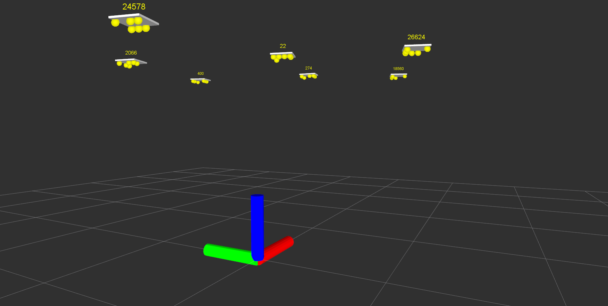

# ROS Wrapper for Stargazer Library
This package contains the ROS Wrapper for our [stargazer library](https://github.com/KIT-MRT/stargazer). The software was developed at the MRT (Institute of Measurement and Control at the Karlsruhe Institute of Technology).



## Installation
### Dependencies
Apart from the standard ROS installation you only need the [stargazer](https://github.com/KIT-MRT/stargazer) library.

## Build
[catkin-tools](https://catkin-tools.readthedocs.io/en/latest/) are recommended as build tools, but a classical build is possible as well:
```
mkdir build
cd build
cmake ..
make
```

## Install
Install via

    make install

## Usage
Mount a camera on your robot, point it towards the ceiling and go.

The main pipeline for running the localization part of the stargazer lib can be run via:

~~~{.shell}
source devel/setup.bash
roslaunch stargazer_ros_tool stargazer_nodelets.launch
~~~

# Documentation
The documentation for this package is written in doyxgen and markdown.

- [How the system works](doc/SystemOverview.md)
- [Setting up the system](doc/SystemSetup.md)
- [Calibrating the landmarks](doc/Calibration.md)
- [The stargazer Pipeline](doc/Pipeline.md)


## Credits

The original system was developed by [Hagisonic](http://www.hagisonic.com). Anyway, apart from the principal idea of using "Star-Like" Landmarks and how their IDs get enumerated, nothing remains from this original system. All software was written in house and even the hardware is an own development.

## License

This program is free software: you can redistribute it and/or modify
it under the terms of the GNU General Public License as published by
the Free Software Foundation, either version 3 of the License, or
(at your option) any later version.

This program is distributed in the hope that it will be useful,
but WITHOUT ANY WARRANTY; without even the implied warranty of
MERCHANTABILITY or FITNESS FOR A PARTICULAR PURPOSE.  See the
GNU General Public License for more details.

You should have received a copy of the GNU General Public License
along with this program.  If not, see <http://www.gnu.org/licenses/>.
