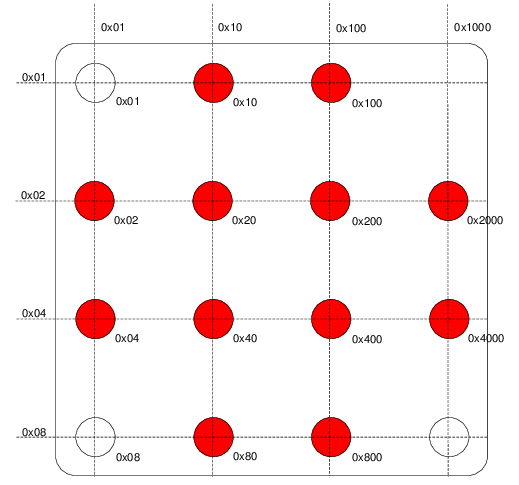

# How it works
The Stargazer-System is a indoor localization system for mobile robots. Analog to navigation in seafaring with the help of stellar constellations, here the own position is acquired by observing Infrared-LED markers on the ceiling. The landmarks are mounted (or suspended from) the rooms ceiling. Each landmark has an individual ID, encoded by the pattern of the LEDs, similar to a stellar constellation.

The robot to be localized is therefor equipped with a camera, pointing upwards, with the stargazer software for image processing and localization and of course with the knowledge of the true positions of the landmarks.

The positions of the landmarks are known (or can be calibrated, see [Calibration](Calibration.md)).

## Landmarks
The landmarks are quadratic PCBs that are about 30cm x 30 cm in size. The LEDs are arranged in a 4×4 Grid, their concrete constellation encoding the landmarks ID. Three of the corner LEDs are always set, while the fourth corner stays unset. These corner points encode the orientation of the landmark. The other, up to 12, LEDs encode the ID.

For encodeing, the hexadecimal system is used. Each of the set LEDs represents one number. The sum of all active LEDs yield the landmarks LED. Encoding works by two simple rules, beginning with to upper left corner, each shift
* by one row results in a multiplication by 2
* by one column results in a bitshift left (in the decimal system: a multiplication by 16)
Note, that the resulting ID is in the hexadecimal system.

The following graphic, will hopefully visualize this encoding system. Note that the unset corner marks the upper right corner!  

More Information on the Landmarks can be found in the [original Starganzer Manual](http://www.hagisonic.com).
