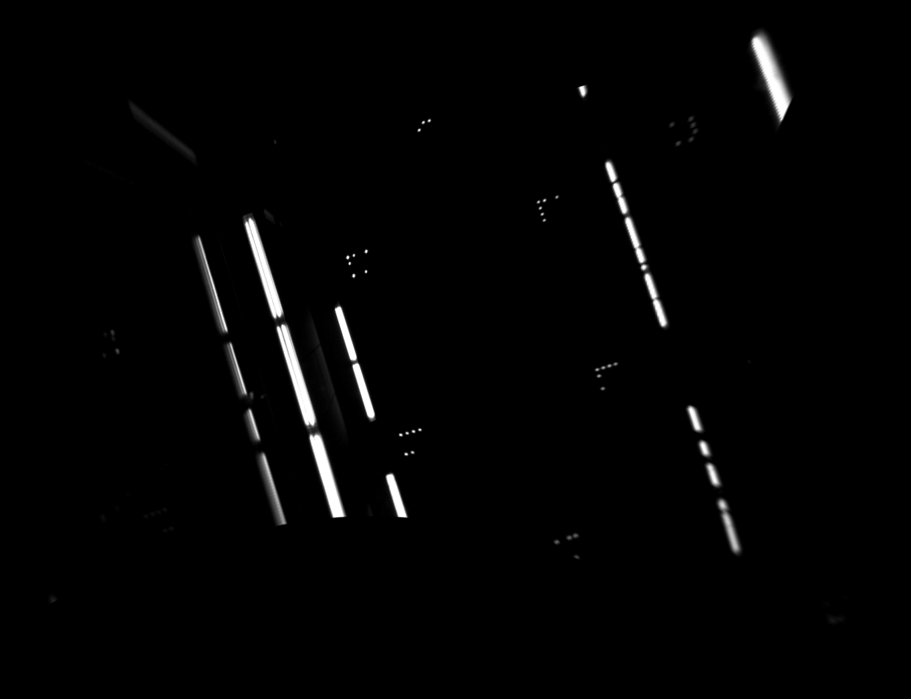

# Setting up the system
To get started, the following steps have to be conducted.

## Activating the landmarks
Plugin the stargazer system. You will find a power plug on the side of the machine hall.
Don't forget to plug it out again, after you are done!

## Setting up the camera
The system works best, if only the LEDs are seen. To assert that, disable auto exposure for your camera and adjust the aperture until you get an image as in the picture below.

If your camera has an optical zoom, you should adjust it to see as many landmarks as possible.  

## Calibrating the camera
The fine calibration of the camera will be taken part of by the calibration algorithm. (See [Calibrating the landmarks](Calibration.md))  

Anyway, you should make sure to get an extrinsic calibration of your camera (rotation and translation of camera to robot coordinate system) and write them to _launch/extrinsic_calibration.launch_.

Also, you should provide some rough estimate of your intrinsic camera parameters in the stargazer config file in _res/stargazer.yaml_.

## Getting the pictures into ROS
There are lots of ready to use camera drivers for ROS available. See the [ROS Wiki page for camera drivers](http://wiki.ros.org/camera_drivers) for example.

Make sure to undistort the pictures if your objective adds a lot of distortion.
